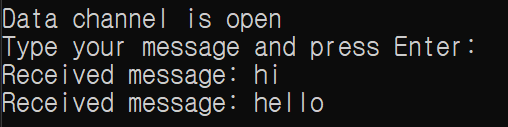
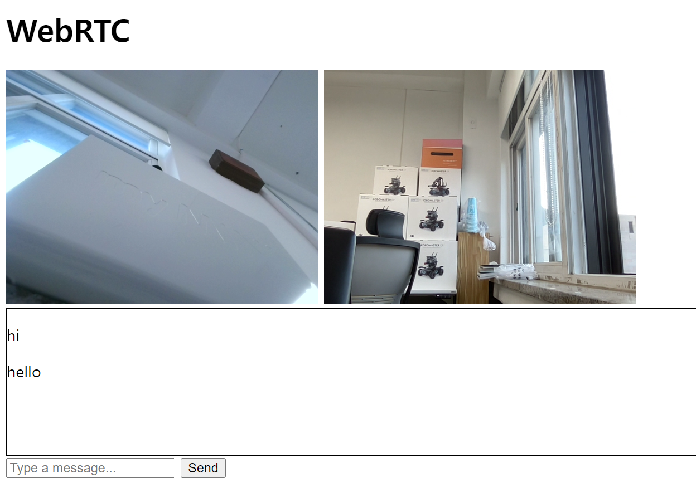

## WebRTC 사용하기 [1]

### 실행 방법
1. [시그널링 서버] con_signaling\index.js 실행
2. [Peer1] con_peer\main.js 실행
3. [Peer2] con_peer\main.js 실행

### 실행 목표
- Peer간 통신 확인
- ICE연결 확인
- DataChannel 생성

### 실행 결과 
- console로 Peer 간 채팅 가능

 

 ## WebRTC 사용하기 [2]

 ### 실행 방법
 - webCam\bro_viedochat\index.js 실행

 ### 실행 목표
 - 브라우저 기반의 영상 송수신 확인

 ### 실행 결과
 - 실시간 화상채팅 가능

 